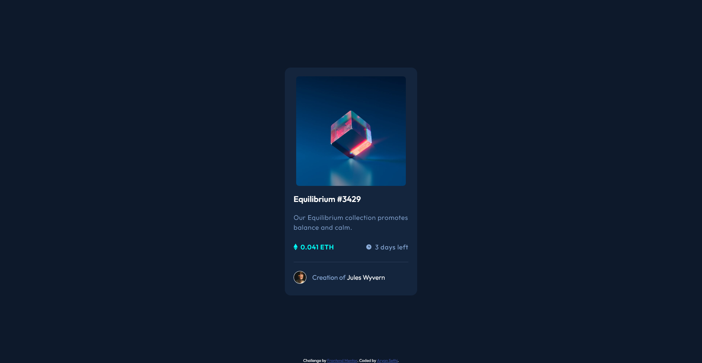

# Frontend Mentor - NFT preview card component solution

This is a solution to the [NFT preview card component challenge on Frontend Mentor](https://www.frontendmentor.io/challenges/nft-preview-card-component-SbdUL_w0U). Frontend Mentor challenges help you improve your coding skills by building realistic projects. 

## Table of contents

- [Overview](#overview)
  - [The challenge](#the-challenge)
  - [Screenshot](#screenshot)
  - [Links](#links)
- [My process](#my-process)
  - [Built with](#built-with)
  - [What I learned](#what-i-learned)
  - [Continued development](#continued-development)
  - [Useful resources](#useful-resources)
- [Author](#author)

## Overview

### The challenge

Users should be able to:

- View the optimal layout depending on their device's screen size
- See hover states for interactive elements

### Screenshot



### Links

- Solution URL: [Index.html file](./index.html)
- Live Site URL: [Order Component UI](https://aryan-ki-codepanti.github.io/nft-card-preview/)

## My process

### Built with

- Semantic HTML5 markup
- CSS custom properties
- Flexbox
- CSS Grid
- Mobile-first workflow

### What I learned

I learnt quite interesting things while making this project
One of them being showing overlay and eye svg on image hover 

```html
    <div class="image-box">
        
        
        <div class="overlay"></div>
    </div>
```
```css
    /* Image */
.image-box{
    display: grid;
    place-items: center;
    position: relative;
    cursor: pointer;
}
.image-box img{
    width: 300px;
    border-radius: var(--Corner-radius);
}

.eye{
    width: 50px !important;
    position: absolute;
    top: 50%;
    transform: translateY(-50%);
    /* height: 20px; */
    display: none;
}

.overlay{
    position: absolute;
    width: 300px;
    background: var(--Cyan-accent);
    inset: 0;
    margin: auto;
    border-radius: var(--Corner-radius);
    display: none;
}

.image-box:hover .eye,
.image-box:hover .overlay{
    display: block;
}
```


### Continued development

For future i would like to focus on improving my CSS skills like responsiveness and play about overlays and accents 

### Useful resources

- [MDN dev docs](https://developer.mozilla.org/) - This helped me for tricks and tips and short lookups for CSS and Javascript.
- [Kevin Powell youtube channel](https://www.youtube.com/kepowob) - This helped me  understanding concepts of flexbox and box-shadows in CSS.

## Author


- Frontend Mentor - [@Aryan-ki-codepanti](https://www.frontendmentor.io/profile/Aryan-ki-codepanti)
- Twitter - [@AryanSe73817078](https://www.twitter.com/AryanSe73817078)
- Youtube - [Channel: Coding Tiger](https://www.youtube.com/channel/UCkz7TnVuNBGEQOTa77lmZfA)